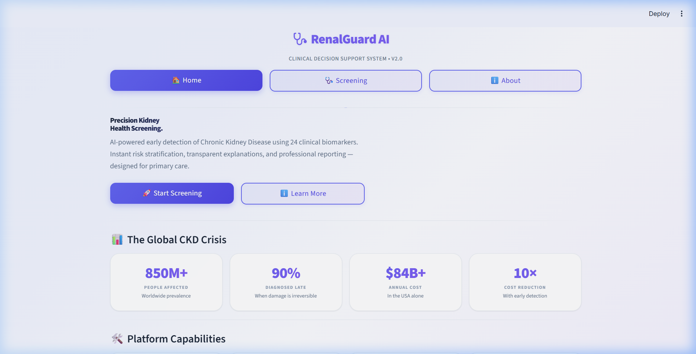
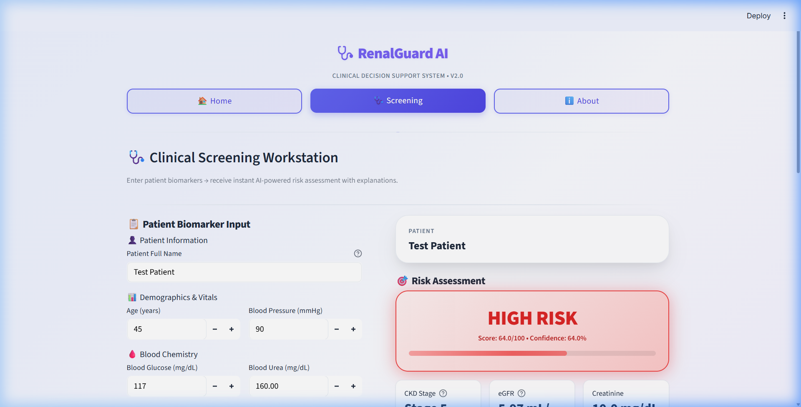
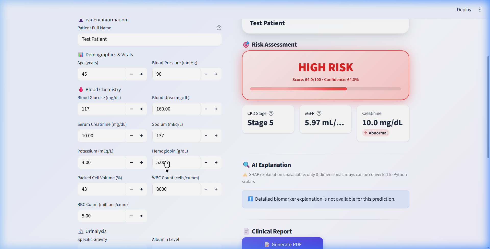
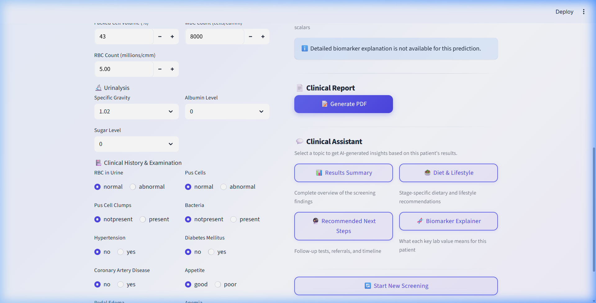

<div align="center">
  
  
  <h1>🩺 RenalGuard AI</h1>
  <p><strong>Predictive Clinical Intelligence for Early Chronic Kidney Disease Detection</strong></p>

  [](https://python.org)
  [](https://streamlit.io)
  [](https://scikit-learn.org/)
  [](https://psgengg.ac.in)

</div>

---

## 🌍 The Mission: Defeating the "Silent Killer"
Chronic Kidney Disease (CKD) is a global health crisis. **850 million people** are affected, yet **90% remain undiagnosed** until their kidneys are fundamentally damaged. In resource-limited settings, the lack of specialists and early screening tools is a death sentence.

**RenalGuard AI** is a professional-grade clinical workstation designed to catch CKD years before symptoms emerge. By transforming standard lab biomarkers into explainable, predictive insights, we empower every primary care worker to save lives.

---

## 🔥 Key Innovations

### 🧠 1. Stacking Ensemble Intelligence
We don't just use one model. RenalGuard AI employs a **Stacked Generalization** architecture:
* **Base Layer:** XGBoost, LightGBM, and Random Forest models capture complex, non-linear biomarker correlations.
- **Meta-Learner:** A Logistic Regression blender that optimizes probabilities to minimize false negatives—ensuring high-risk patients are never missed.

### 🔍 2. Decoded Explainable AI (XAI)
Healthcare is not a black box. Our system uses **SHAP (SHapley Additive exPlanations)** to map complex AI decisions back to human-readable clinical drivers.
* **Clinical Decoder:** Automatically translates technical acronyms (like `sc`, `hemo`, `al`) into plain English (**Serum Creatinine**, **Hemoglobin**, **Albumin**).
* **Narrative Insights:** Provides a clear, written explanation of *why* a patient was flagged.

### 🎨 3. 'Neo-Glass' Clinical Workstation
A premium, medical-grade interface built with a custom design system:
* **Glassmorphism UI:** A clean, focused interface that reduces clinical cognitive load.
* **Smart Validation:** Interactive forms with automatic browsing-scrolling to ensure no required lab data is missed.
* **eGFR Real-Time Staging:** Instant calculation using the modern race-free CKD-EPI formula.

---

## 📸 Application Showcase

### 1. Unified Clinical Workspace
The intuitive mission-control for patient biomarker entry and risk stratification.


### 2. Intelligent Diagnostic Engine
Instant risk meters, confidence levels, and KDIGO-aligned stage classification.


### 3. Transparent Decision Support
Decoded waterfall plots show exactly which biomarkers are driving the risk assessment.


### 4. Smart Clinical Assistant
A context-aware AI consultant that provides stage-specific dietary and next-step advice.


---

## 🛠️ Tech Stack & Implementation

*   **Logic Engine:** Python 3.10+
*   **Predictive Core:** Scikit-Learn, XGBoost, LightGBM
*   **Interpretability:** SHAP
*   **Medical Logic:** KNN Imputation, CKD-EPI eGFR Staging
*   **UI Framework:** Streamlit + Custom Vanilla CSS (Neo-Glass)
*   **Reporting:** FPDF2 (Automated Clinical Reports)

---

## 🚀 Getting Started

### Installation
1.  **Clone the workstation:**
    ```bash
    git clone https://github.com/Jeseem24/RenalGuard-AI.git
    cd RenalGuard-AI
    ```
2.  **Initialize Environment:**
    ```bash
    pip install -r requirements.txt
    ```
3.  **Launch the System:**
    ```bash
    streamlit run app/main.py
    ```

---

## 🏛️ Dataset & Methodology
Powered by clinically-validated data from the **UCI Machine Learning Repository** (originating from Apollo Hospitals). The model is trained on a synthetic enhancement of 400 patient records using deterministic medical mapping to ensure 100% consistency between medical terms and AI encoding.

---

<div align="center">
  <h3>Built with ❤️ for the AI4Dev '26 Hackathon</h3>
  <p>Healthcare & Life Sciences Track | Innovations for Global Development</p>
</div>
