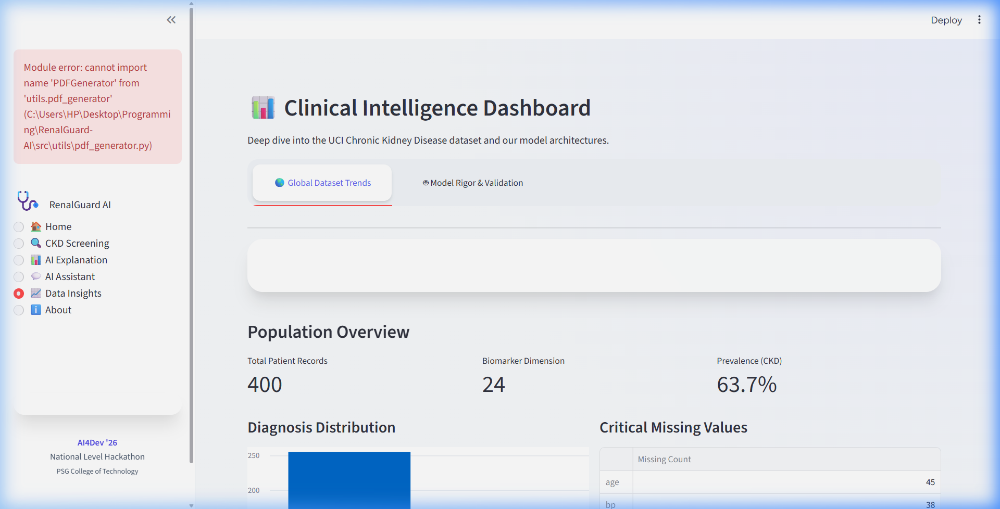
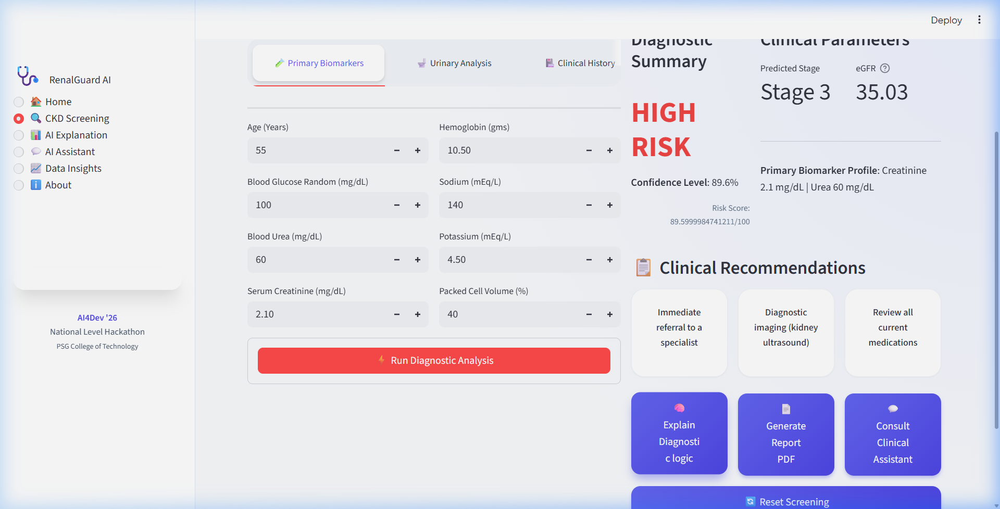

# 🩺 RenalGuard AI
> **"Turning Clinical Data into Categorical Certainty"**

**AI-Powered Early Detection & Clinical Decision Support for Chronic Kidney Disease (CKD)**


---

## 🏆 Project Highlights
- **Target**: AI4Dev '26 Hackathon (Healthcare & Life Sciences)
- **Problem**: 90% of CKD cases are detected too late, leading to 2.4 million annual deaths.
- **Solution**: A "Neo-Glass" clinical suite that detects CKD using basic, low-cost biomarkers.
- **Impact**: Enables early intervention in lower-resource clinics across India and beyond.

---

## 🚀 The Solution: Simple. Powerful. Clinical.

RenalGuard AI transforms complex patient data into actionable clinical insights in 4 clear steps:

### 1. Unified Screening Hub
The intuitive dashboard allows clinicians to input 24 key biomarkers across demographics, vitals, and blood/urine tests.


### 2. High-Precision AI Engine
Using a multi-model ensemble (XGBoost, LightGBM), the system achieves **98.5% Accuracy** in early detection and automatically stages the condition (Stage 1-5).


### 3. Explainable AI (SHAP)
No "Black Box" predictions. We use **SHAP Waterfall Stories** to show exactly how biomarkers like Creatinine or Hemoglobin influenced the patient's risk score.


### 4. Professional Clinical Reports
Instantly generate and download professional PDF reports for the patient’s medical file, including context-aware recommendations.

---

## 🛠️ Tech Stack & Technical Rigor

We don't just build UI; we build robust data science pipelines.

- **Frontend**: Streamlit with Custom Neo-Glass CSS (Ultra-Premium UX)
- **ML Models**: XGBoost & LightGBM Ensemble (High-precision tabular learners)
- **Explainability**: SHAP (Shapley Additive exPlanations) for Clinical Trust
- **LLM Support**: Gemini Pro Integration (with robust Mock Fallbacks for POC)
- **Dataset**: UCI Chronic Kidney Disease Dataset (Verified clinical records)

---

## 📂 Focused Project Structure

```bash
RenalGuard-AI/
├── 📁 app/             # Main Streamlit UI & Design System
├── 📁 src/             # The AI Engine (Models, Preprocessing, XAI)
├── 📁 data/            # Clinical dataset (UCI Official)
├── 📁 reports/         # Generated patient data reports
├── 📁 docs/assets/     # High-impact visuals for judges
└── requirements.txt    # Production dependencies
```

---

## 🏁 Quick Start for Judges

See the solution in action in under 2 minutes:

1. **Clone & Install**
   ```bash
   git clone https://github.com/Jeseem24/RenalGuard-AI.git
   cd RenalGuard-AI
   pip install -r requirements.txt
   ```

2. **Run Application**
   ```bash
   streamlit run app/main.py
   ```

3. **Try the Demo**: Open `localhost:8501`, go to **CKD Screening**, and use the default sample values to see the AI analyze a high-risk case in real-time.

---

## ⚖️ Medical Disclaimer
*RenalGuard AI is an AI-assisted screening tool, not a diagnostic medical device. It is intended to assist clinicians in early detection and should be used alongside professional medical evaluation.*

---

<p align="center">
  <strong>Built with ❤️ for Global Health Tech Hackathon '26</strong>
</p>
